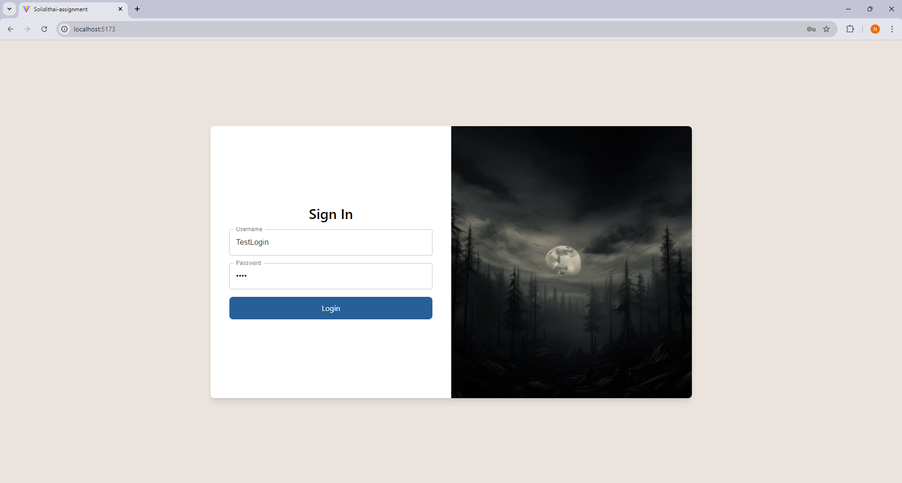
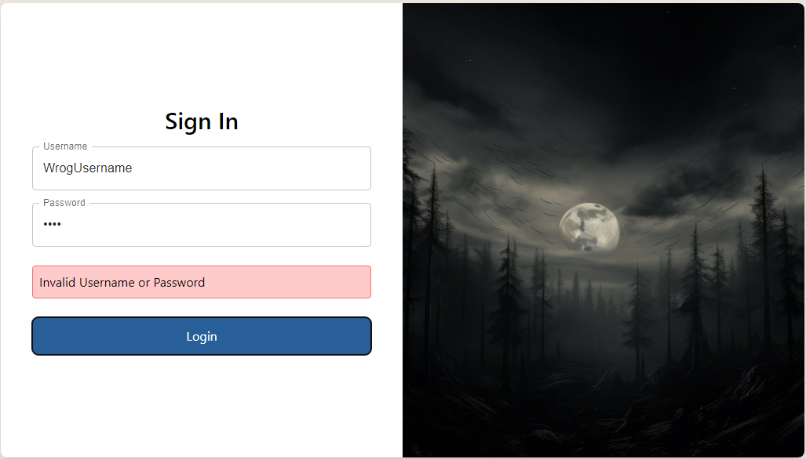
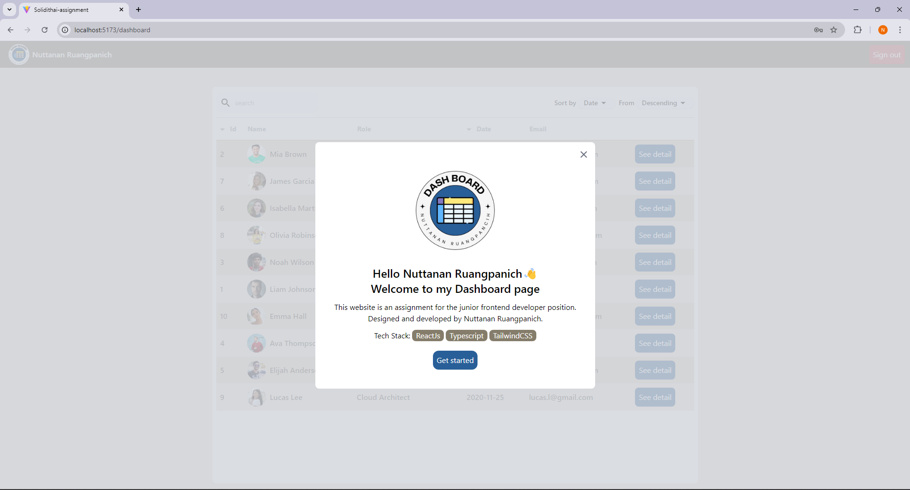
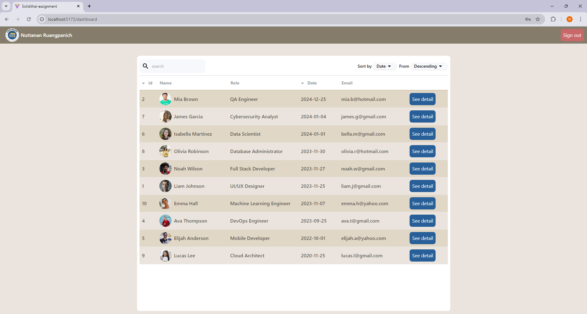
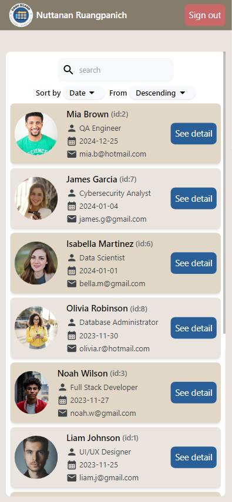
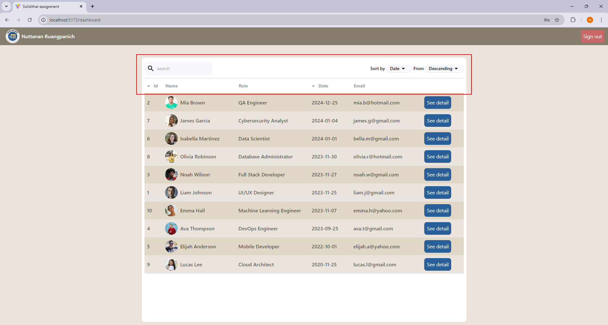
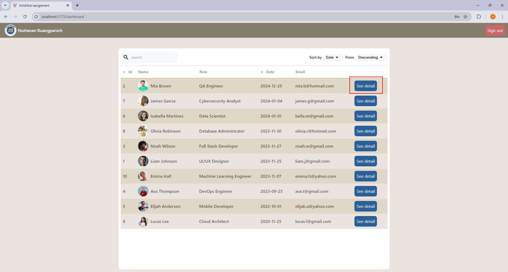
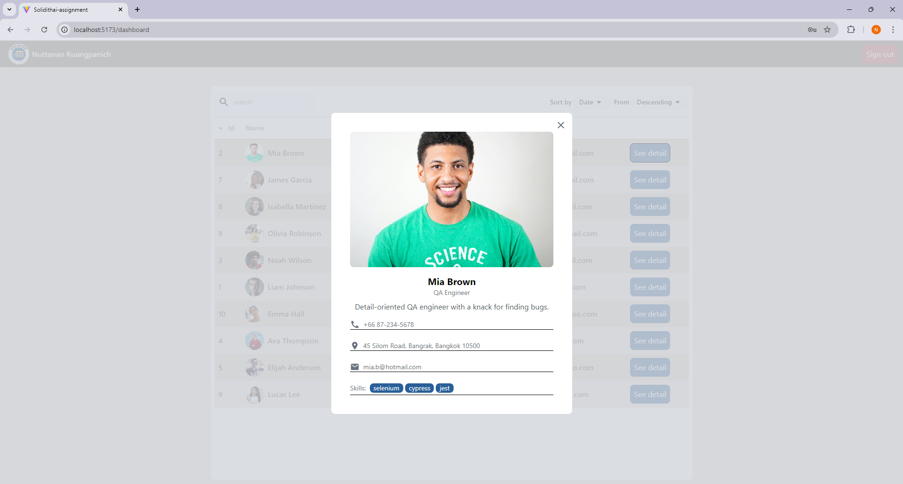
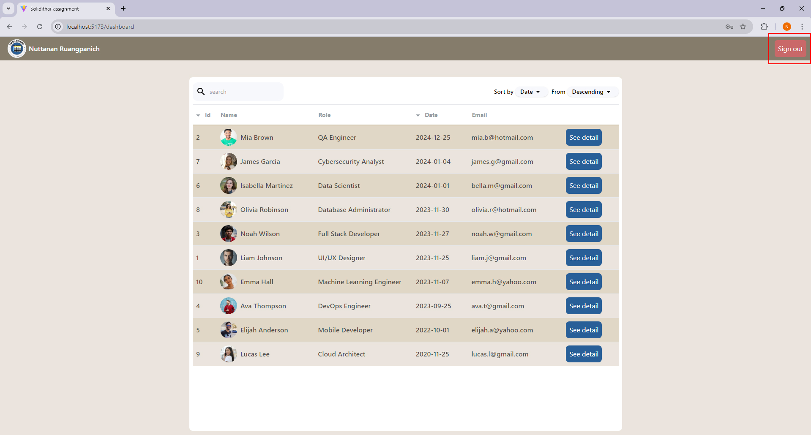

## Name: Nuttanan Ruangpanich

### Set up Project

```
git clone https://github.com/Nuttanan29445/Dashboard-assignment.git
cd Dashboard-assignment
npm install
npm run dev
```

## How to use this website?

### Step1: Sign In

- Sign In with username: TestLogin and password: 1234, then click "Log in" button



- If you enter the wrong username or password, you will see an error message:



### Step2: Welcome Message

- After logging in, you will see a welcome modal. Click "Get Started" to proceed.



### Step3: Dashboard Page

- After that, you will be taken to the Dashboard page which shows a list of users.

##### Desktop:



##### Mobile:



- The Dashboard allows you to search, filter, and sort the data by Id and Date, with options to sort either in ascending or descending order.



### step4: View User Details

- Click the "See detail" button to open a modal showing detailed information about the user.




### step5: Sign out

- You can log out by clicking the "Sign out" button.


